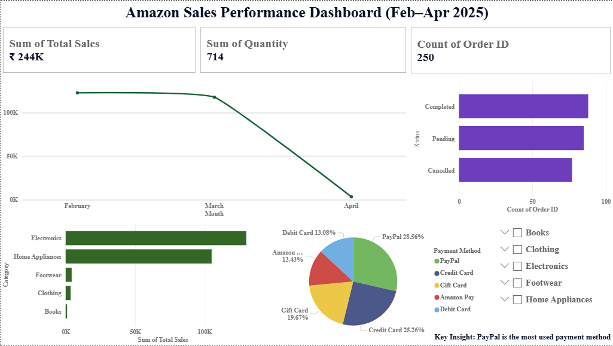

# Amazon Sales Performance Dashboard (Feb–Apr 2025)

## 📌 Project Overview
This project showcases an interactive Amazon Sales Dashboard built in Power BI to analyze sales performance over a three-month period (Feb–Apr 2025). The dashboard provides clear insights into sales trends, customer behavior, and business performance to support data-driven decision-making.

---

## 📊 Dashboard Views & Screenshots

### 1. Amazon Sales Dashboard
*An interactive overview of sales trends, category-wise performance, and order status breakdown.*


---

## 📈 Key KPIs Tracked
* **Total Sales**: ₹244K (Total revenue generated over the period).
* **Total Quantity Sold**: 714 units (Volume of items purchased).
* **Total Orders**: 250 orders (Total number of transactions completed).

---

## 🔍 Key Insights & Analysis
1. **Sales Trends**: Sales dropped significantly in April compared to the previous months.
2. **Category Performance**: Electronics emerged as the top-performing category.
3. **Payment Preferences**: PayPal was the most preferred payment method among customers.
4. **Order Status**: The breakdown of orders shows completed, pending, and cancelled states for transaction monitoring.

---

## 🛠️ Features & Highlights
* **End-to-End Development**: Built the dashboard entirely from a raw, simulated Amazon sales dataset.
* **Data Prep**: Applied data cleaning and transformation in Power Query.
* **Interactive Design**: Created interactive visuals, KPI cards, pie charts, and custom slicers (Category, Payment Method, Status).
* **Business Insights**: Identified payment preferences and sales trends to support strategic planning.

---

## 📂 Project Structure
```text
Amazon-Sales-Powerbi-Dashboard/
│
├── Dataset.csv                      # Raw Amazon Sales Dataset
├── Amazon_Sales_Dashboard.pbix       # Power BI Workbook
├── Amazon_Sales_Dashboard.pdf        # Dashboard Export (PDF)
├── dashboard.png                    # Dashboard Preview Image
└── README.md                        # Project Documentation
```

---

## 🌐 Interactive Links & Downloads

🔗 [Download Dashboard PDF](Amazon_Sales_Dashboard.pdf)

---

# 👨‍💻 Author

**Moin Ahmed**

* 🔗 **LinkedIn**: [linkedin.com/in/moin-ahmed27](https://www.linkedin.com/in/moin-ahmed27/)
* 💻 **GitHub**: [github.com/Moin-27](https://github.com/Moin-27)
* 📊 **Tableau Public**: [public.tableau.com/app/profile/moin.ahmed27](https://public.tableau.com/app/profile/moin.ahmed27)
* 🌐 **Portfolio**: [moin-27.github.io/Portfolio](https://moin-27.github.io/Portfolio/)
